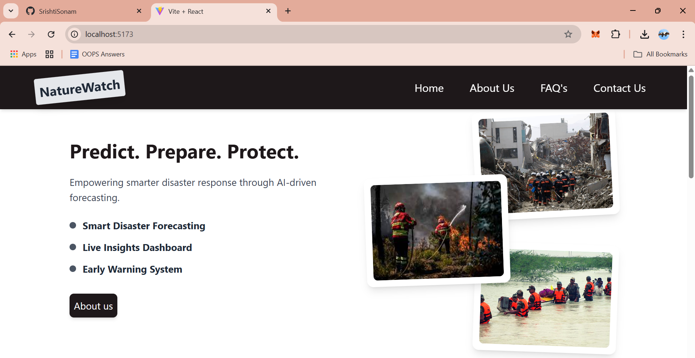
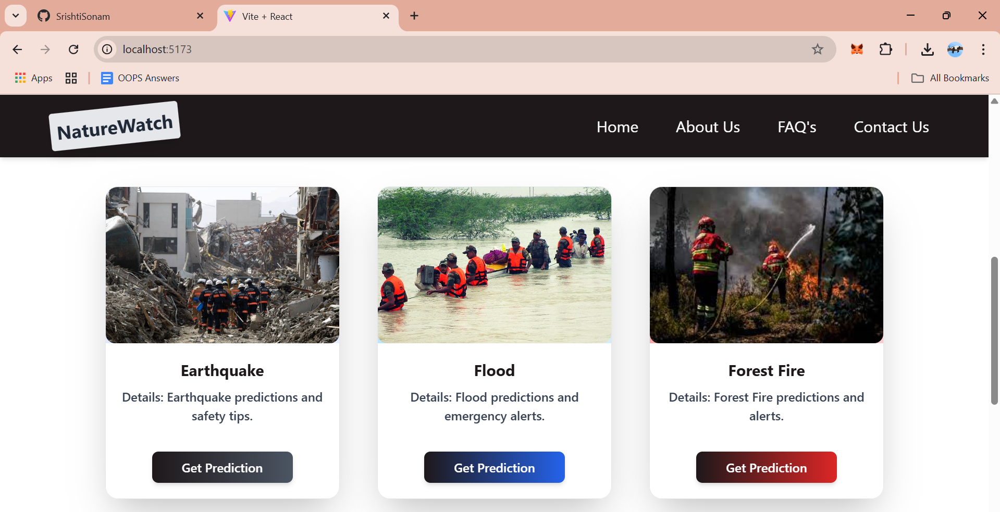
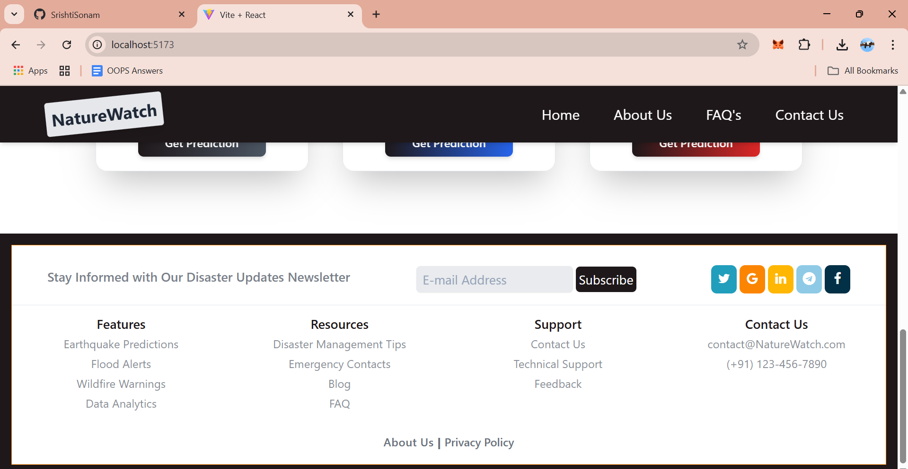
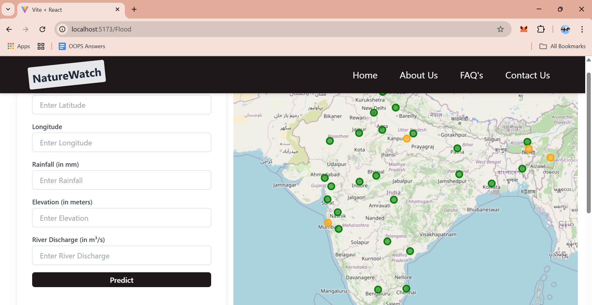
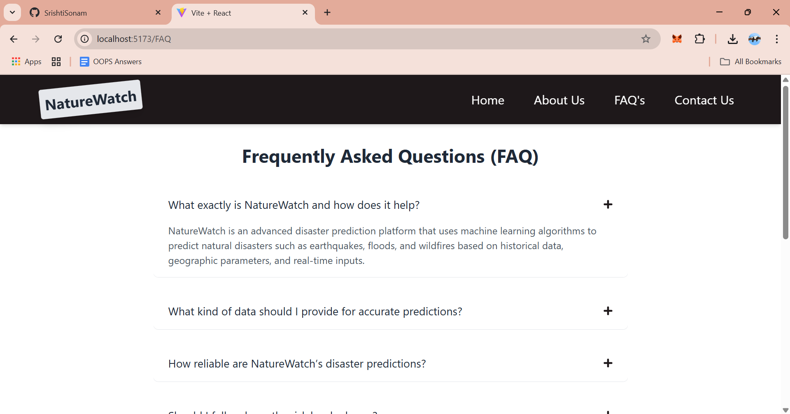

# Nature Watch 🌍🔍

## Overview
This project aims to predict natural disasters such as **earthquakes, floods, and forest fires** using **Machine Learning**. It features a **clean and intuitive UI** built with **React.js & Tailwind CSS**, while the backend is powered by **Flask** for efficient data processing and predictions.

## Features
- 📊 **Predicts earthquakes, floods, and forest fires** based on historical data.
- 🛠️ **Machine Learning models** trained using various datasets.
- 🌐 **Interactive web application** with an intuitive UI.
- 🔥 **Built with React.js, Tailwind CSS (Frontend) & Flask (Backend).**

---

## Screenshots


### Home Page




### Disaster Prediction


### About Us



### Contact Us


---

## Tech Stack
- **Frontend**: React.js, Tailwind CSS
- **Backend**: Flask, Python
- **ML Libraries**: Pandas, NumPy, Scikit-Learn
- **Data Visualization**: Matplotlib, Seaborn

---

## Dataset & Preprocessing
The dataset is collected from multiple sources, containing data on past disasters. The preprocessing steps include:
1. **Exploratory Data Analysis (EDA)**
   - Handling missing values
   - Feature engineering
   - Data visualization
2. **Data Cleaning & Transformation**
   - Normalization & scaling
   - Encoding categorical variables
3. **Model Training & Evaluation**
   - Splitting dataset into training & testing
   - Training ML models (Logistic Regression, Random Forest, Neural Networks, etc.)
   - Evaluating model performance using accuracy, precision, recall, and F1-score

---

## Model Integration
Once the model is trained and tested, it is integrated into a Flask API to serve predictions to the web application.
- The **Flask API** receives input data, processes it, and returns predictions.
- The **React.js frontend** consumes the API and displays the results in an interactive manner.

---

## Installation & Setup
### 1️⃣ Clone the Repository
```bash
git clone 
```

### 2️⃣ Backend Setup (Flask)
```bash
cd backend
pip install -r requirements.txt
python app.py
```

### 3️⃣ Frontend Setup (React.js)
```bash
cd frontend
npm install
npm start
```

## Usage
- **Enter relevant disaster data** (location, weather conditions, etc.) in the web app.
- **The ML model predicts the probability** of a disaster occurring.
- **Results are displayed visually** with recommendations (if applicable).

---

## Future Enhancements
- 📌 Integrate **real-time data sources** for live predictions.
- 🛰️ Use **satellite imagery** for forest fire detection.
- 🌍 Develop a **mobile app** for accessibility.

---

## Contributing
Contributions are welcome! Feel free to fork the repo, create a new branch, and submit a pull request.

---


